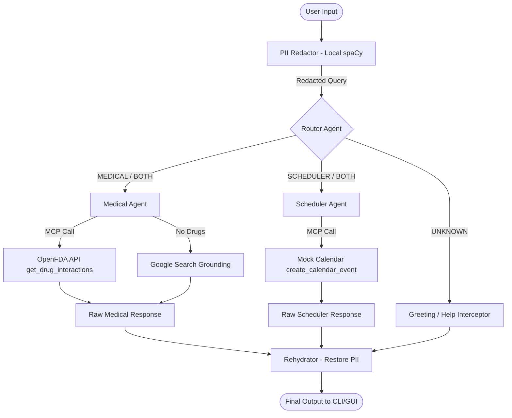

# MedBridge AI: Secure Multi-Agent Health Concierge

## The Problem: Fragmented Care & Medical Misinformation

Managing personal health, especially chronic conditions or navigating public health concerns, is a fragmented, high-stakes experience. Patients struggle to synthesize information from disparate sources: doctor's notes, medication labels, and conflicting online articles. During public health events, localized, actionable guidance is often buried under waves of misinformation.

A simple chatbot cannot solve this. It requires an **autonomous system** that can reason, securely query live medical APIs, cross-reference data, and take action.

---

## The Solution: MedBridge AI

MedBridge AI is a secure, locally-deployable multi-agent system designed for the **Agents for Good** track. It acts as a personal and public health concierge. Users can input messy, real-world text (e.g., a doctor's email or a list of symptoms), and the system routes the query to specialized agents that fetch live data, check for drug interactions, schedule reminders, and provide grounded medical guidance.

**Why Agents?** Standard LLMs can hallucinate medical facts. MedBridge AI uses a Multi-Agent architecture to separate concerns: one agent strictly handles data retrieval via APIs, another handles scheduling, and a router dictates the flow. This ensures deterministic, safe, and verifiable actions.

---

## Architecture & System Flow



---

## Architecture & Course Concept Integration

This project leverages the concepts of agent-driven application design, focusing on 5 key areas:

### 1. Multi-Agent System (ADK)
Built with modular agent architecture:
*   **Router Agent:** The entry point that classifies user intent (e.g., `MEDICAL`, `SCHEDULER`, `BOTH`, or `UNKNOWN`).
    *   *Code:* See [agents/router_agent.py](file:///D:/Hackathon/5%20days%20Ai%20agents%20-%20kaggle/medbridge-ai/agents/router_agent.py).
*   **Medical Agent:** Handles drug interaction checks and general public health information.
    *   *Code:* See [agents/medical_agent.py](file:///D:/Hackathon/5%20days%20Ai%20agents%20-%20kaggle/medbridge-ai/agents/medical_agent.py).
*   **Scheduler Agent:** Extracts times and dates to set up reminders and appointments.
    *   *Code:* See [agents/scheduler_agent.py](file:///D:/Hackathon/5%20days%20Ai%20agents%20-%20kaggle/medbridge-ai/agents/scheduler_agent.py).

### 2. Model Context Protocol (MCP) Server
To provide agents with real-time, accurate data access, the system includes a custom MCP server:
*   **Tools Exposed:**
    *   `get_drug_interactions` (calls the OpenFDA Adverse Events API).
    *   `create_calendar_event` (mocks scheduling a system/calendar event).
*   *Code:* See [mcp_server/server.py](file:///D:/Hackathon/5%20days%20Ai%20agents%20-%20kaggle/medbridge-ai/mcp_server/server.py).

### 3. Privacy & Security (PII Redaction Middleware)
Healthcare data requires strict privacy. Before text is sent to any cloud LLM, it passes through a local **PII Redaction Middleware** using spaCy:
*   Redacts personal names, locations, and organizations (e.g., *"Mr. Smith"* becomes `[PERSON_0]`).
*   Whitelists medication names (e.g., *"Lisinopril"*, *"Potassium"*) to prevent them from being redacted.
*   Rehydrates the agent responses to put the redacted details back in before showing them to the user.
*   *Code:* See [security/pii_redactor.py](file:///D:/Hackathon/5%20days%20Ai%20agents%20-%20kaggle/medbridge-ai/security/pii_redactor.py).

### 4. Dynamic Web Grounding
When the Medical Agent encounters general health queries instead of specific drug lists, it enables Google Search grounding to retrieve verified search data, citing its sources to prevent hallucination.

### 5. Multi-Interface Deployability (CLI & Web GUI)
The codebase includes:
*   A CLI tool built with Python's `click` library (run using `python main.py query "your query"`).
*   A responsive Web GUI serving a dashboard with security inspector logs and interactive charts (run using `python main.py gui`).

---

## Demo Scenario Walkthrough

### 1. Input
A messy, forwarded email from a doctor:
> *"Hi, starting Mr. Smith on Lisinopril 10mg. He is also taking Potassium supplements. Remind him to check blood pressure next Tuesday."*

### 2. Security Middleware (Local PII Masking)
The local spaCy engine tokenizes the inputs. *"Smith"* is detected as a person and masked, while *"Lisinopril"* and *"Potassium"* are whitelisted as drugs and left unredacted:
*   **Redacted Prompt:** *"Hi, starting Mr. [PERSON_0] on Lisinopril 10mg. He is also taking Potassium supplements. Remind him to check blood pressure next Tuesday."*

### 3. Routing
The Router Agent classifies the intent as `BOTH` (requires both medical drug checks and scheduling reminders).

### 4. Medical Agent (MCP Call to OpenFDA)
The Medical Agent recognizes the two medications and calls the MCP tool:
```python
get_drug_interactions(drug_list=["Lisinopril", "Potassium supplements"])
```
It returns the interaction warning regarding ACE inhibitors (Lisinopril) and potassium supplements increasing the risk of hyperkalemia (high blood potassium levels).

### 5. Scheduler Agent (MCP Call to Calendar)
The Scheduler Agent extracts the action and time and calls the calendar tool:
```python
create_calendar_event(title="Check blood pressure", date_time="next Tuesday at 9:00 AM")
```

### 6. Output & Rehydration
The responses are merged, and the rehydration helper restores `[PERSON_0]` back to `Mr. Smith`.
*   **Medical response:** Explains the risk of hyperkalemia when combining Lisinopril and potassium supplements, and prompts the patient to consult their doctor.
*   **Scheduler response:** Confirms the calendar event reminder has been scheduled for next Tuesday at 9:00 AM.
