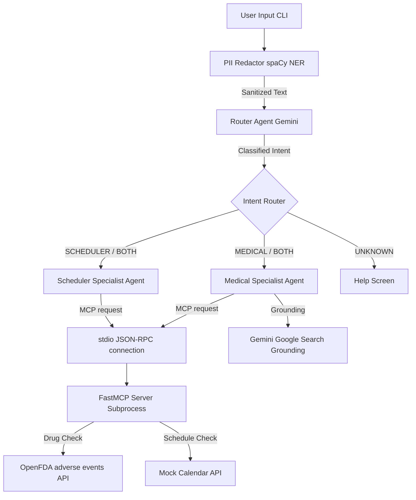

# MedBridge AI 🏥

> **A Secure, Multi-Agent Health Concierge — Powered by Google Gemini, MCP, and spaCy NLP**

**Kaggle AI Agents Intensive Course — Capstone Project**  
**Track:** Agents for Good  
**GitHub Repository:** [deveshpunjabi/MedBridge-AI](https://github.com/deveshpunjabi/MedBridge-AI)

---

## 🎯 What is MedBridge AI?

MedBridge AI is a security-first, locally-deployable multi-agent system designed to act as a health concierge. It processes natural language medical text (such as doctor's notes, medication questions, and scheduling requests) through a secure, pipeline-based architecture to protect privacy and deliver expert assistance.

Key workflow stages:
1.  **PII/PHI Masking**: spaCy NER strips Personally Identifiable Information locally *before* any external LLM request.
2.  **Intent Classification**: A Router Agent routes queries using Gemini's structured output.
3.  **Specialist Specialists**:
    *   **Medical Specialist Agent**: Performs drug-drug interaction checks using Model Context Protocol (MCP) tool integration and grounds public health inquiries using native Google Search grounding.
    *   **Scheduler Specialist Agent**: Coordinates medication reminders and appointments via an MCP calendar tool.

---

## 🏗️ Architecture & Data Flow

The following Mermaid diagram shows the pipeline flow from raw user input to specialized agent output:



---

## 🔑 Core Design Decisions

| Decision | Rationale |
| :--- | :--- |
| **Local spaCy NER Redaction** | Relying on LLMs to redact PII in-context is unreliable. Preprocessing text locally using spaCy's NLP models ensures that sensitive personal identifiers (PERSON, GPE, ORG) never leave the local environment. |
| **Drug Name Whitelisting** | spaCy's general model (`en_core_web_sm`) occasionally misidentifies medications as people (`PERSON`). We implemented a custom medical whitelist to keep drug names intact, ensuring the Medical Agent has the raw details necessary to perform interaction checks. |
| **Constrained JSON Routing** | To prevent fragile text-parsing errors, the Router Agent queries Gemini in JSON mode with a schema constraint enum `["MEDICAL", "SCHEDULER", "BOTH", "UNKNOWN"]` to guarantee deterministic routing. |
| **Subprocess stdio MCP Server** | Spawning the MCP server as a subprocess communicating via standard input/output (stdio) decouples the tools from the main process and conforms exactly to the MCP JSON-RPC protocol specification. |
| **Native Google Search Grounding** | For volatile data like disease outbreaks, we use Gemini's built-in Google Search grounding rather than custom scrapers, ensuring highly relevant responses complete with web citations. |

---

## 🏆 Kaggle Rubric Coverage

| Rubric Criterion | MedBridge AI Implementation | Key Files |
| :--- | :--- | :--- |
| **ADK / Agent Pattern** | Multi-agent router-specialist setup that sequences specialized agents (Medical, Scheduler) based on classified intent. | `agents/*.py` |
| **MCP Server** | Real `FastMCP` server running over stdio as a subprocess, exposing `get_drug_interactions` and `create_calendar_event` tools. | `mcp_server/server.py` |
| **Security Features** | local spaCy NER redaction of PII before any API request, whitelisting to protect medical nouns, and `.env` loading for secrets. | `security/pii_redactor.py` |
| **Grounding** | Medical Agent uses `types.Tool(google_search=...)` to retrieve live outbreak statistics. | `agents/medical_agent.py` |
| **CLI Deployability** | Click-based CLI supporting query files, string text, Windows console UTF-8 fixes, and offline mock execution (`--mock`). | `main.py` |
| **Code Quality** | Clean, modular codebase featuring type hints, PEP-compliant docstrings, and comprehensive error fallback routines. | Entire codebase |

---

## 🚀 Getting Started & Installation

### 1. Installation
Ensure Python dependencies and spaCy language models are installed:
```bash
pip install -r requirements.txt
python -m spacy download en_core_web_sm
```

### 2. Configuration
Copy the environment variables template and configure your API key:
```bash
cp .env.example .env
# Edit .env and set your key:
# GEMINI_API_KEY=your_gemini_api_key_here
```
> [!NOTE]
> Get a free API key at [Google AI Studio](https://aistudio.google.com/app/api-keys).

### 3. Verification Commands

*   **Run PII Self-Test**:
    ```bash
    python security/pii_redactor.py
    ```

*   **Test Pipeline (Mock Mode - No API Key)**:
    ```bash
    python main.py query --mock "Dr. Smith prescribed Lisinopril. Remind me to take it at 8am tomorrow."
    ```

*   **Test Interaction (Live Mode)**:
    ```bash
    python main.py query "Check drug interactions for Aspirin and Warfarin"
    ```

*   **Test Search Grounding (Live Mode)**:
    ```bash
    python main.py query "What is the latest update on the seasonal flu outbreak?"
    ```

---

## 📁 Repository Structure

*   [main.py](file:///D:/Hackathon/5%20days%20Ai%20agents%20-%20kaggle/medbridge-ai/main.py): CLI Entry point, reconfigures Windows stdout encoding, and spawns the MCP server.
*   [config.py](file:///D:/Hackathon/5%20days%20Ai%20agents%20-%20kaggle/medbridge-ai/config.py): Validates API keys and defines paths.
*   [security/pii_redactor.py](file:///D:/Hackathon/5%20days%20Ai%20agents%20-%20kaggle/medbridge-ai/security/pii_redactor.py): spaCy NER PII/PHI redaction middleware with drug whitelisting.
*   [mcp_server/server.py](file:///D:/Hackathon/5%20days%20Ai%20agents%20-%20kaggle/medbridge-ai/mcp_server/server.py): Stdio-based FastMCP tool server querying OpenFDA.
*   [agents/router_agent.py](file:///D:/Hackathon/5%20days%20Ai%20agents%20-%20kaggle/medbridge-ai/agents/router_agent.py): Classifies user input into structured JSON enums.
*   [agents/medical_agent.py](file:///D:/Hackathon/5%20days%20Ai%20agents%20-%20kaggle/medbridge-ai/agents/medical_agent.py): Calls OpenFDA tools via MCP and performs Google Search grounding.
*   [agents/scheduler_agent.py](file:///D:/Hackathon/5%20days%20Ai%20agents%20-%20kaggle/medbridge-ai/agents/scheduler_agent.py): Calls calendar event tools via MCP.
