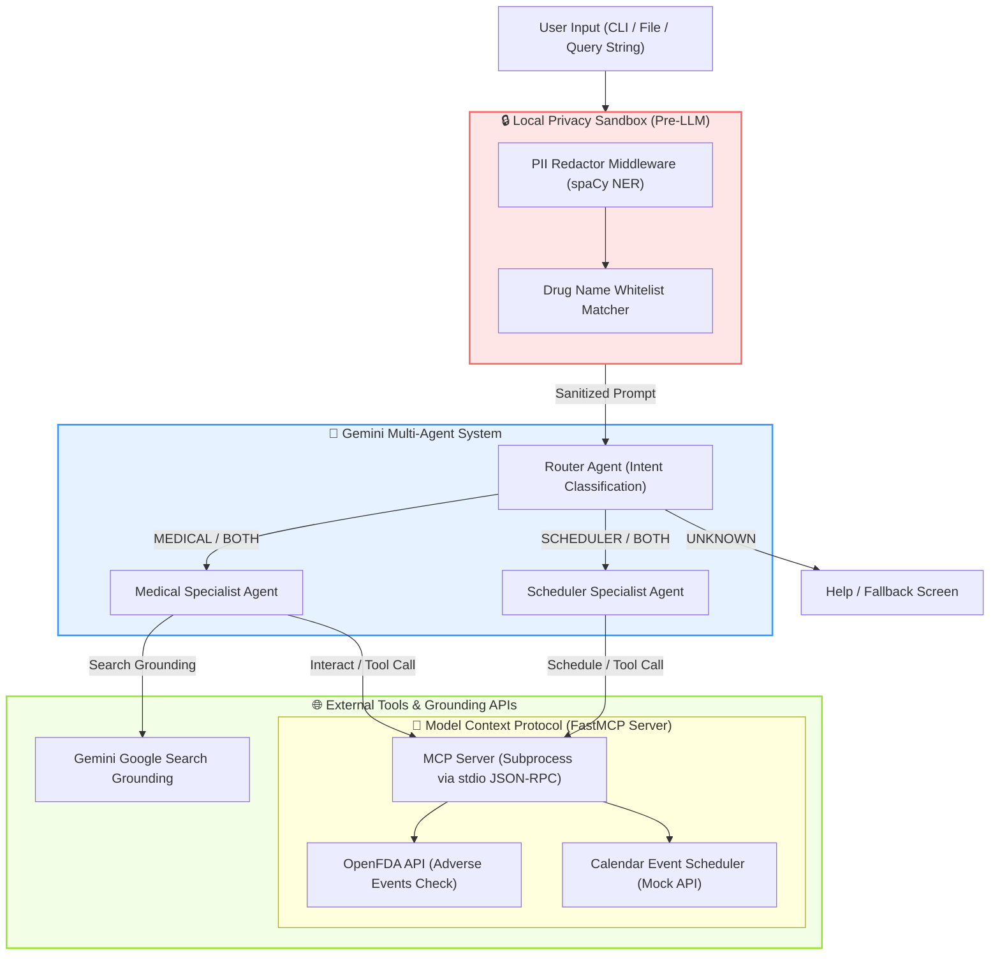

# MedBridge AI 🏥

> **A Secure, Multi-Agent Health Concierge — Powered by Google Gemini, MCP, and spaCy NLP**

**Kaggle AI Agents Intensive Course — Capstone Project**  
**Track:** Agents for Good  
**GitHub Repository:** [deveshpunjabi/MedBridge-AI](https://github.com/deveshpunjabi/MedBridge-AI)

---

## 🎯 Overview

**MedBridge AI** is a locally-deployable, security-first multi-agent system designed to act as a personal health concierge. It processes messy, free-text medical queries (such as clinical notes, medication schedules, or symptom logs) and securely processes them through a pipeline that:
1. **Redacts PII/PHI locally** using spaCy NLP before any data is sent to external API endpoints.
2. **Classifies user intent** using a Gemini-powered Router Agent with a strict schema JSON constraint.
3. **Performs drug-drug interaction checks** via a Medical Specialist Agent querying the live OpenFDA API through standard Model Context Protocol (MCP) tools.
4. **Grounds public health inquiries** using native Google Search grounding to retrieve real-time data complete with citations.
5. **Schedules medication reminders** via a Scheduler Specialist Agent that interfaces with a calendar tool over MCP.

All orchestration is wrapped in a production-grade Click CLI supporting both live model execution and a fully offline-safe mock mode (`--mock`).

---

## 🏗️ Architecture & Data Flow

The following Mermaid diagram shows the pipeline flow from raw user input to specialized agent output:



---

## 🔒 Local Privacy Sandbox & PII Redaction

To comply with patient privacy principles, MedBridge AI redacts sensitive personal identifiers *locally* before transmitting any user query to the LLM backend.

### 1. spaCy Named Entity Recognition (NER) vs Regex
* **Brittle Regex Limitations**: Simple regular expressions are poor at identifying names and locations, often confusing normal nouns/verbs with names.
* **Context-Aware NER**: The system uses spaCy's `en_core_web_sm` model, which analyzes grammatical structure to accurately detect:
  * `PERSON` &rarr; `[REDACTED_PERSON]` (e.g., patient, doctor names)
  * `GPE` &rarr; `[REDACTED_LOCATION]` (e.g., cities, states, physical addresses)
  * `ORG` &rarr; `[REDACTED_ORG]` (e.g., hospital, clinic names)

### 2. Drug Name Whitelisting
spaCy's general-purpose model occasionally misclassifies medications (like *Aspirin* or *Lisinopril*) as `PERSON` entities. If these were redacted, downstream medical agents could not perform interaction checks. 
* **The Solution**: We implement a custom medical whitelist containing common drug names. Whitelisted terms are bypassed and preserved, ensuring critical medical context remains intact.

### 3. Case-Sensitive Mock Pattern Redactor
For the offline mock pipeline (`--mock`), the local PII redactor applies a case-sensitive regular expression matching only capitalized words following identifiers like `"I am"` or `"my name is"`. This prevents the system from redacting common lowercase verbs (e.g., `"taking"`) or common nouns that happen to be followed by capitalized drugs:
* **Input**: `"I am taking Aspirin."`
* **Output**: `"I am taking Aspirin."` *(Verb 'taking' and drug 'Aspirin' are preserved)*
* **Input**: `"I am John Doe."`
* **Output**: `"I am [REDACTED_PERSON]."` *(Capitalized name redacted)*

---

## 🤖 Multi-Agent Orchestration

The system employs a multi-agent router-specialist architecture:

1. **Router Agent** ([router_agent.py](file:///D:/Hackathon/5%20days%20Ai%20agents%20-%20kaggle/medbridge-ai/agents/router_agent.py)): 
   Uses Gemini 2.0 with a strict JSON schema constraint to map queries into an intent enum: `["MEDICAL", "SCHEDULER", "BOTH", "UNKNOWN"]`.
2. **Medical Agent** ([medical_agent.py](file:///D:/Hackathon/5%20days%20Ai%20agents%20-%20kaggle/medbridge-ai/agents/medical_agent.py)): 
   Uses the OpenFDA MCP tool to query drug safety. If a generic health outbreak query is detected, it triggers native Google Search Grounding to return current information with web citations.
3. **Scheduler Agent** ([scheduler_agent.py](file:///D:/Hackathon/5%20days%20Ai%20agents%20-%20kaggle/medbridge-ai/agents/scheduler_agent.py)): 
   Extracts reminder details and interfaces with the MCP calendar tool to register events.
4. **Safety Sequencing**: 
   When the Router detects `BOTH` intents, the coordinator executes the Medical Agent *first* to ensure drug safety before scheduling any appointment or dosage reminder.

---

## 🔌 Model Context Protocol (MCP) Integration

MedBridge AI implements the Model Context Protocol (MCP) to decouple tool definitions from LLM logic. 
* **FastMCP Server**: Exposes tools built with `mcp.server.fastmcp` in [server.py](file:///D:/Hackathon/5%20days%20Ai%20agents%20-%20kaggle/medbridge-ai/mcp_server/server.py).
* **Stdio Subprocess Execution**: The CLI coordinator (`main.py`) spawns the MCP server as a subprocess communicating over Standard Input/Output (`stdio`), conforming strictly to the official JSON-RPC protocol specification.
* **Exposed Tools**:
  * `get_drug_interactions(drugs: list)`: Queries the live FDA database for reports linking drug combinations to adverse events.
  * `create_calendar_event(title: str, datetime_str: str)`: Configures local reminders and schedules.

---

## 🏆 Kaggle Capstone Rubric Mapping

| Rubric Criterion | MedBridge AI Implementation | File Reference |
| :--- | :--- | :--- |
| **ADK / Agent Pattern** | Multi-agent architecture (Router + Medical Specialist + Scheduler Specialist) with structured JSON routing and safety-first sequential execution. | [router_agent.py](file:///D:/Hackathon/5%20days%20Ai%20agents%20-%20kaggle/medbridge-ai/agents/router_agent.py) |
| **MCP Server** | A standard-compliant Model Context Protocol server built with `FastMCP` running over stdio as a subprocess. Exposes live FDA API tool call and calendar tool call. | [server.py](file:///D:/Hackathon/5%20days%20Ai%20agents%20-%20kaggle/medbridge-ai/mcp_server/server.py) |
| **Security Features** | local spaCy NER PHI/PII redaction preceding LLM routing, medication whitelist protection, and secure API key loading from `.env`. | [pii_redactor.py](file:///D:/Hackathon/5%20days%20Ai%20agents%20-%20kaggle/medbridge-ai/security/pii_redactor.py) |
| **Grounding** | Medical agent leverages native Gemini Google Search grounding to retrieve live disease outbreaks and public health advisories with citations. | [medical_agent.py](file:///D:/Hackathon/5%20days%20Ai%20agents%20-%20kaggle/medbridge-ai/agents/medical_agent.py) |
| **CLI Deployability** | Command-line interface built with Click, featuring query strings, file parsing, console encoding fixes, and an offline-safe `--mock` mode. | [main.py](file:///D:/Hackathon/5%20days%20Ai%20agents%20-%20kaggle/medbridge-ai/main.py) |
| **Code Quality** | Consistent PEP-compliant type hints, comprehensive error handlers, clear separation of concerns, and clean logging. | Entire repository |

---

## 🚀 Getting Started & Installation

### 1. Prerequisites & Environment Setup
Create and activate a virtual environment (recommended):
```bash
# Windows
python -m venv venv
.\venv\Scripts\activate

# macOS / Linux
python3 -m venv venv
source venv/bin/activate
```

### 2. Install Dependencies
Install packages and download spaCy's English language model:
```bash
pip install -r requirements.txt
python -m spacy download en_core_web_sm
```

### 3. API Keys Configuration
Copy `.env.example` to `.env` and fill in your Gemini API key:
```env
GEMINI_API_KEY=your_google_gemini_api_key_here
```
> [!NOTE]
> Get a free API key at [Google AI Studio](https://aistudio.google.com/app/api-keys).

---

## 🛠️ Verification & Demo Commands

### 1. Validate the local PII Redactor
Verify that spaCy NER is correctly redacting patient details while whitelisting medications:
```bash
python security/pii_redactor.py
```

### 2. Run Pipeline in Mock Mode (No API Key Required)
Run a full test query offline to see the coordinated multi-agent execution in action:
```bash
python main.py query --mock "I am taking Aspirin and Warfarin. Remind me to check with Dr. Jones next Monday at 10am."
```

#### Expected Output logs:
```text
╔═══════════════════════════════════════════════════════════════════╗
║                                                                   ║
║   ███╗   ███╗███████╗██████╗ ██████╗ ██████╗ ██╗██████╗  ██████╗ ║
║   ████╗ ████║██╔════╝██╔══██╗██╔══██╗██╔══██╗██║██╔══██╗██╔════╝ ║
║   ██╔████╔██║█████╗  ██║  ██║██████╔╝██████╔╝██║██║  ██║██║  ███╗║
║   ██║╚██╔╝██║██╔══╝  ██║  ██║██╔══██╗██╔══██╗██║██║  ██║██║   ██║║
║   ██║ ╚═╝ ██║███████╗██████╔╝██████╔╝██║  ██║██║██████╔╝╚██████╔╝║
║   ╚═╝     ╚═╝╚══════╝╚═════╝ ╚═════╝ ╚═╝  ╚═╝╚═╝╚═════╝  ╚═════╝║
║                          A I                                      ║
║                                                                   ║
║   🏥 Your Secure Health Concierge — Powered by Multi-Agent AI     ║
║                                                                   ║
╚═══════════════════════════════════════════════════════════════════╝

  Mode: 🧪 MOCK MODE

━━━━━━━━━━━━━━━━━━━━━━━━━━━━━━━━━━━━━━━━━━━━━━━━━━━━━━━━━━━━
📝 Input received:
   I am taking Aspirin and Warfarin. Remind me to check with Dr. Jones next Monday at 10am.

━━━━━━━━━━━━━━━━━━━━━━━━━━━━━━━━━━━━━━━━━━━━━━━━━━━━━━━━━━━━
🔒 [Security] Applying PII redaction...
   ✓ PII detected and redacted

🔀 [Router] Classifying intent...
   ✓ Intent: 💊📅 BOTH

💊 [Medical Agent] Processing...

──────────────────────────────────────────────────
💊 Medical Agent Response:
💊 **Drug Interaction Check** (Mock Mode)

Medications analyzed: Aspirin, Warfarin

⚠️ **Potential Interaction Found:**
The combination of Aspirin and Warfarin has been associated with adverse event reports in the FDA database.

**Recommendations:**
• Consult your doctor before combining these medications
• Monitor for unusual symptoms
• Do not stop any medication without medical guidance

⚕️ Please consult a healthcare professional for personalized medical advice.

📅 [Scheduler Agent] Processing...

──────────────────────────────────────────────────
📅 Scheduler Agent Response:
📅 **Scheduling Confirmation** (Mock Mode)

✅ Calendar event created successfully!

   📌 **Event:** Check with dr
   📅 **When:** Monday at 10am
   🔔 **Reminder:** 30 minutes before

Your reminder has been set. I'll make sure you don't forget!

============================================================
MedBridge AI processing complete.
```

### 3. Run live queries (Requires API Key)
* **Check Drug Interactions via Live MCP FDA Tools**:
  ```bash
  python main.py query "Are there any interactions between Metformin and Contrast Dye?"
  ```
* **Query Outbreaks via Gemini Google Search Grounding**:
  ```bash
  python main.py query "What is the latest update on the seasonal influenza outbreak in New York?"
  ```

---

## 📂 Repository Structure

* 📂 [agents/](file:///D:/Hackathon/5%20days%20Ai%20agents%20-%20kaggle/medbridge-ai/agents): Core multi-agent logic.
  * 📄 [router_agent.py](file:///D:/Hackathon/5%20days%20Ai%20agents%20-%20kaggle/medbridge-ai/agents/router_agent.py): Classes and routing logic.
  * 📄 [medical_agent.py](file:///D:/Hackathon/5%20days%20Ai%20agents%20-%20kaggle/medbridge-ai/agents/medical_agent.py): Live OpenFDA calling and Google Search Grounding.
  * 📄 [scheduler_agent.py](file:///D:/Hackathon/5%20days%20Ai%20agents%20-%20kaggle/medbridge-ai/agents/scheduler_agent.py): Appointment extraction and calendar event builder.
* 📂 [security/](file:///D:/Hackathon/5%20days%20Ai%20agents%20-%20kaggle/medbridge-ai/security): Safety middleware.
  * 📄 [pii_redactor.py](file:///D:/Hackathon/5%20days%20Ai%20agents%20-%20kaggle/medbridge-ai/security/pii_redactor.py): Local PII/PHI redaction utilizing spaCy NER and drug whitelists.
* 📂 [mcp_server/](file:///D:/Hackathon/5%20days%20Ai%20agents%20-%20kaggle/medbridge-ai/mcp_server): Stdio-based tool servers.
  * 📄 [server.py](file:///D:/Hackathon/5%20days%20Ai%20agents%20-%20kaggle/medbridge-ai/mcp_server/server.py): FastMCP API implementation for FDA API calls and calendar scheduling.
* 📄 [main.py](file:///D:/Hackathon/5%20days%20Ai%20agents%20-%20kaggle/medbridge-ai/main.py): CLI orchestrator, Click setup, and environment verification.
* 📄 [config.py](file:///D:/Hackathon/5%20days%20Ai%20agents%20-%20kaggle/medbridge-ai/config.py): App configurations, model definition, and environment loading.

---

## 🔧 Troubleshooting

* **Unicode/Encoding Errors**: If your terminal crashes displaying ASCII characters or emojis, verify that you are running Python 3.7+ and that your Windows terminal is configured for UTF-8 (`chcp 65001`). The code handles standard console encoding overrides, but extreme Windows legacy shell versions might still fail.
* **spaCy Model Missing Error**: If you see `OSError: [E050] Can't find model 'en_core_web_sm'`, run `python -m spacy download en_core_web_sm` and verify your path references.
* **OpenFDA API Rate Limiting**: The OpenFDA API is public and does not require keys, but excessive queries in live mode can cause transient HTTP `429` rate limiting. MedBridge AI will print a warning and gracefully degrade to standard guidance if this occurs.
