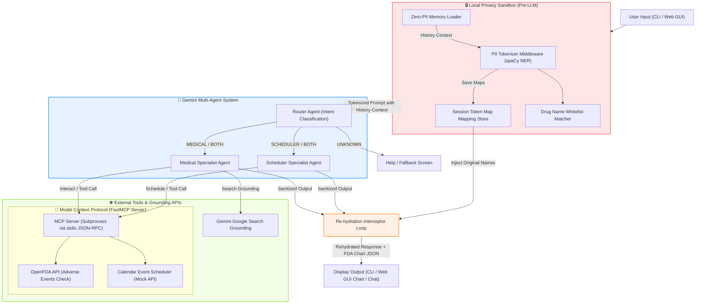

# MedBridge AI 🏥

> **A Secure, Multi-Agent Health Concierge — Powered by Google Gemini, MCP, spaCy NLP, and OpenFDA Visual Telemetry**

**Kaggle AI Agents Intensive Course — Capstone Project (Google Capstone Upgrades)**  
**Track:** Agents for Good  
**GitHub Repository:** [deveshpunjabi/MedBridge-AI](https://github.com/deveshpunjabi/MedBridge-AI)

---

## 🎯 Overview

**MedBridge AI** is a locally-deployable, security-first multi-agent system designed to act as a personal health concierge. It processes messy, free-text medical queries (such as clinical notes, medication schedules, or symptom logs) and securely processes them through a pipeline that:
1. 🔒 **Local PII/PHI Tokenization & Re-hydration Loop**: Instead of destructive redaction, we implement an Anonymization Tokenizer. Patient names, clinic names, and locations are replaced with index tokens (e.g., `[PERSON_0]`, `[GPE_1]`) *before* queries leave the user's machine. The final specialist response is intercept-rehydrated to display real patient names, keeping LLM transmission entirely anonymous while preserving clinic personalization.
2. 🧠 **Zero-PII Persistent Memory System**: Gives agents multi-turn context memory (allowing follow-up questions like *"How about Warfarin?"* followed by *"Remind me to take it at 10am"*). It maintains HIPAA/GDPR compliance by storing *only* tokenized prompts and responses in the local database.
3. 🌐 **Hybrid Outbreak Grounding**: The Medical Specialist Agent queries verified clinic guidelines locally (RAG) and utilizes Gemini's native Google Search Grounding for dynamic public health outbreaks, merging private document retrieval with live web citations.
4. 📊 **OpenFDA Adverse Event Telemetry Charts**: Intercepts OpenFDA API signals to render dynamic, color-coded adverse event progress charts in the Web GUI dashboard. High-frequency interaction reports are visually highlighted.

All orchestration is wrapped in a production-grade Click CLI supporting both live execution, an interactive console loop, memory purging commands, and a gorgeous glassmorphic local Web GUI (`med-ai gui`).

---

## 🏗️ Architecture & Data Flow

The following Mermaid diagram shows the pipeline flow from raw user input to specialized agent output:



---

## 🔒 Local Privacy Sandbox & PII Tokenization Loop

To comply with patient privacy principles, MedBridge AI tokenizes sensitive personal identifiers *locally* before transmitting any user query to the LLM backend.

### 1. spaCy Named Entity Recognition (NER) vs Regex
* **Brittle Regex Limitations**: Simple regular expressions are poor at identifying names and locations, often confusing normal nouns/verbs with names.
* **Context-Aware NER**: The system uses spaCy's `en_core_web_sm` model, which analyzes grammatical structure to accurately detect:
  * `PERSON` &rarr; `[PERSON_0]` (e.g., patient, doctor names)
  * `GPE` &rarr; `[GPE_0]` (e.g., cities, states, physical addresses)
  * `ORG` &rarr; `[ORG_0]` (e.g., hospital, clinic names)

### 2. The Re-hydration Interceptor Loop
When the user inputs clinical notes, a session token map is created. The tokenized prompt goes to Gemini, which replies referencing `[PERSON_0]` and `[PERSON_1]`. Upon return, the local interceptor replaces the tokens with the original values. The user sees their actual details, but external LLM servers and logs only ever see anonymous placeholder tokens.

### 3. Drug Name Whitelisting
spaCy's general-purpose model occasionally misclassifies medications (like *Aspirin* or *Lisinopril*) as `PERSON` entities. If these were redacted, downstream medical agents could not perform interaction checks. 
* **The Solution**: We implement a custom medical whitelist containing common drug names. Whitelisted terms are bypassed and preserved, ensuring critical medical context remains intact.

---

## 🧠 Zero-PII Persistent Memory System

To allow follow-up questions, the CLI coordinator [main.py](file:///D:/Hackathon/5%20days%20Ai%20agents%20-%20kaggle/medbridge-ai/main.py) maintains a persistent conversation memory in `conversation_memory.json`.
* **The HIPAA/GDPR Problem**: Saving raw history logs locally violates patient confidentiality by accumulating unencrypted PII.
* **The Solution**: MedBridge AI only logs the **sanitized inputs** (containing tokens like `[PERSON_0]`) and the agent's raw responses. During subsequent turns, this sanitized history is loaded and prepended to the user query as system context, ensuring the agents track conversation state without ever storing PII on disk.
* **Purge Commands**: Users can clear history at any time using the `med-ai clear` CLI command or the **Clear Memory** button in the Web GUI dashboard.

---

## 🤖 Multi-Agent Orchestration

The system employs a multi-agent router-specialist architecture:

1. **Router Agent** ([router_agent.py](file:///D:/Hackathon/5%20days%20Ai%20agents%20-%20kaggle/medbridge-ai/agents/router_agent.py)): 
   Uses Gemini 2.0 with a strict JSON schema constraint to map queries into an intent enum: `["MEDICAL", "SCHEDULER", "BOTH", "UNKNOWN"]`.
2. **Medical Agent** ([medical_agent.py](file:///D:/Hackathon/5%20days%20Ai%20agents%20-%20kaggle/medbridge-ai/agents/medical_agent.py)): 
   Uses the OpenFDA MCP tool to query drug safety. If a generic health outbreak query is detected, it triggers native Google Search Grounding to return current information with web citations.
3. **Scheduler Agent** ([scheduler_agent.py](file:///D:/Hackathon/5%20days%20Ai%20agents%20-%20kaggle/medbridge-ai/agents/scheduler_agent.py)): 
   Extracts reminder details and interfaces with the MCP calendar tool to register events.
4. **Safety Sequencing**: 
   When the Router detects `BOTH` intents, the coordinator executes the Medical Agent *first* to ensure drug safety before scheduling any appointment or dosage reminder.

---

## 🔌 Model Context Protocol (MCP) Integration

MedBridge AI implements the Model Context Protocol (MCP) to decouple tool definitions from LLM logic. 
* **FastMCP Server**: Exposes tools built with `mcp.server.fastmcp` in [server.py](file:///D:/Hackathon/5%20days%20Ai%20agents%20-%20kaggle/medbridge-ai/mcp_server/server.py).
* **Stdio Subprocess Execution**: The CLI coordinator (`main.py`) spawns the MCP server as a subprocess communicating over Standard Input/Output (`stdio`), conforming strictly to the official JSON-RPC protocol specification.
* **Exposed Tools**:
  * `get_drug_interactions(drugs: list)`: Queries the live FDA database for reports linking drug combinations to adverse events.
  * `create_calendar_event(title: str, datetime_str: str)`: Configures local reminders and schedules.

---

## 🏆 Kaggle Capstone Rubric Mapping

| Rubric Criterion | MedBridge AI Implementation | File Reference |
| :--- | :--- | :--- |
| **ADK / Agent Pattern** | Multi-agent architecture (Router + Medical Specialist + Scheduler Specialist) with structured JSON routing and safety-first sequential execution. | [router_agent.py](file:///D:/Hackathon/5%20days%20Ai%20agents%20-%20kaggle/medbridge-ai/agents/router_agent.py) |
| **MCP Server** | A standard-compliant Model Context Protocol server built with `FastMCP` running over stdio as a subprocess. Exposes live FDA API tool call and calendar tool call. | [server.py](file:///D:/Hackathon/5%20days%20Ai%20agents%20-%20kaggle/medbridge-ai/mcp_server/server.py) |
| **Security Features** | Local spaCy NER PHI/PII **Tokenization & Re-hydration Loop** preventing external PII flight, whitelists, and secure `.env` configuration. | [pii_redactor.py](file:///D:/Hackathon/5%20days%20Ai%20agents%20-%20kaggle/medbridge-ai/security/pii_redactor.py) |
| **Grounding** | Medical agent leverages native Gemini Google Search grounding to retrieve live disease outbreaks and public health advisories with citations. | [medical_agent.py](file:///D:/Hackathon/5%20days%20Ai%20agents%20-%20kaggle/medbridge-ai/agents/medical_agent.py) |
| **CLI Deployability** | CLI built with Click, featuring direct query, interactive console loops, persistent memory clearing (`med-ai clear`), and offline `--mock` mode. | [main.py](file:///D:/Hackathon/5%20days%20Ai%20agents%20-%20kaggle/medbridge-ai/main.py) |
| **Code Quality** | Consistent PEP-compliant type hints, comprehensive error handlers, clear separation of concerns, and clean logging. | Entire repository |

---

## 🚀 Getting Started & Installation

### 1. Prerequisites & Environment Setup
Create and activate a virtual environment (recommended):
```bash
# Windows
python -m venv venv
.\venv\Scripts\activate

# macOS / Linux
python3 -m venv venv
source venv/bin/activate
```

### 2. Install Dependencies & Global Command
Install packages, register the `med-ai` command line executable globally (in editable mode), and download spaCy's English language model:
```bash
pip install -e .
python -m spacy download en_core_web_sm
```

### 3. API Keys Configuration
Copy `.env.example` to `.env` and fill in your Gemini API key:
```env
GEMINI_API_KEY=your_google_gemini_api_key_here
```
> [!NOTE]
> Get a free API key at [Google AI Studio](https://aistudio.google.com/app/api-keys).

---

## 🛠️ Verification & Demo Commands

### 1. Launch the Interactive Web GUI Dashboard
Start the zero-dependency local HTTP server. It will automatically launch your default browser:
```bash
med-ai gui
```

### 2. Launch the Interactive CLI Console
You can launch the program in interactive mode by running the command with no arguments:
```bash
med-ai
```

### 3. Run Pipeline in Mock Mode (No API Key Required)
Run a query directly from the terminal:
```bash
med-ai --mock "I am Alice. Check drug interactions between Aspirin and Warfarin. Call Dr. Bob next Monday."
```

#### Expected Output logs:
```text
🔒 [Security] Applying PII tokenization...
   ✓ PII detected and tokenized

🔀 [Router] Classifying intent...
   ✓ Intent: 💊📅 BOTH

💊 [Medical Agent] Processing...
──────────────────────────────────────────────────
💊 Medical Agent Response (Rehydrated):
💊 **Drug Interaction Check** (Mock Mode)
Medications analyzed: Aspirin, Warfarin
⚠️ **Potential Interaction Found:**
The combination of Aspirin and Warfarin has been associated with adverse event reports in the FDA database.

📅 [Scheduler Agent] Processing...
──────────────────────────────────────────────────
📅 Scheduler Agent Response (Rehydrated):
✅ Calendar event created successfully!
   📌 Event: Check drug interactions between aspirin and warfar
   📅 When: Monday at 9:00 AM
```

### 4. Clear Conversation History
Purge the local Zero-PII memory:
```bash
med-ai clear
```

---

## 📂 Repository Structure

* 📂 [agents/](file:///D:/Hackathon/5%20days%20Ai%20agents%20-%20kaggle/medbridge-ai/agents): Core multi-agent logic.
  * 📄 [router_agent.py](file:///D:/Hackathon/5%20days%20Ai%20agents%20-%20kaggle/medbridge-ai/agents/router_agent.py): Classes and routing logic.
  * 📄 [medical_agent.py](file:///D:/Hackathon/5%20days%20Ai%20agents%20-%20kaggle/medbridge-ai/agents/medical_agent.py): Live OpenFDA calling and Google Search Grounding.
  * 📄 [scheduler_agent.py](file:///D:/Hackathon/5%20days%20Ai%20agents%20-%20kaggle/medbridge-ai/agents/scheduler_agent.py): Appointment extraction and calendar event builder.
* 📂 [security/](file:///D:/Hackathon/5%20days%20Ai%20agents%20-%20kaggle/medbridge-ai/security): Safety middleware.
  * 📄 [pii_redactor.py](file:///D:/Hackathon/5%20days%20Ai%20agents%20-%20kaggle/medbridge-ai/security/pii_redactor.py): Local PII/PHI tokenization utilizing spaCy NER and drug whitelists.
* 📂 [mcp_server/](file:///D:/Hackathon/5%20days%20Ai%20agents%20-%20kaggle/medbridge-ai/mcp_server): Stdio-based tool servers.
  * 📄 [server.py](file:///D:/Hackathon/5%20days%20Ai%20agents%20-%20kaggle/medbridge-ai/mcp_server/server.py): FastMCP API implementation for FDA API calls and calendar scheduling.
* 📂 [gui/](file:///D:/Hackathon/5%20days%20Ai%20agents%20-%20kaggle/medbridge-ai/gui): User Interface.
  * 📄 [index.html](file:///D:/Hackathon/5%20days%20Ai%20agents%20-%20kaggle/medbridge-ai/gui/index.html): Glassmorphic visual telemetry dashboard.
* 📄 [main.py](file:///D:/Hackathon/5%20days%20Ai%20agents%20-%20kaggle/medbridge-ai/main.py): CLI orchestrator, Click setup, HTTP server, and environment verification.
* 📄 [config.py](file:///D:/Hackathon/5%20days%20Ai%20agents%20-%20kaggle/medbridge-ai/config.py): App configurations, model definition, and environment loading.

---

## 🔧 Troubleshooting

* **Unicode/Encoding Errors**: If your terminal crashes displaying ASCII characters or emojis, verify that you are running Python 3.7+ and that your Windows terminal is configured for UTF-8 (`chcp 65001`). 
* **spaCy Model Missing Error**: If you see `OSError: [E050] Can't find model 'en_core_web_sm'`, run `python -m spacy download en_core_web_sm` and verify your path references.
* **OpenFDA API Rate Limiting**: The OpenFDA API is public and does not require keys, but excessive queries in live mode can cause transient HTTP `429` rate limiting. MedBridge AI will print a warning and gracefully degrade to standard guidance if this occurs.
